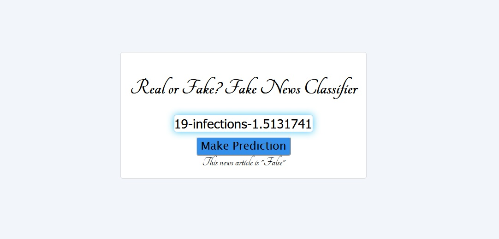
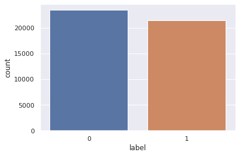

# fake-news-classification-app

## Fake news classifier web application now available! Click  [here!](https://real-or-fake-news.herokuapp.com/)

### Introduction
This is an end-to-end data science/machine learning project exploring a fake news dataset with exploratory data analysis, using NLP tools and machine learning to classify fake and genuine news. The model is used in a Django web application where a news article URL is entered as input and predicts whether the article is genuine or fake.

### Folders
"0. fake-news-analysis-training" contains exploratory data analysis of the data, model training and evaluation.

"1. hyperparameter-tuning" contains a notebook examining how to hyperparameter tune a Random Forest model. Because of the large dataset used, only a sample (2000 example for each class) is used for this investigation. The current model is NOT tuned, and is up to the user whether to go down this route.

"2. app" contains the web application, using Django and Heroku. Using and virtual environment is highly advisable. See "How to load virtual environment" below for details.

### Data

Data used for this project can be found from [Kaggle](https://www.kaggle.com/clmentbisaillon/fake-and-real-news-dataset/notebooks). Credit goes to Clément Bisaillon for creating the dataset.

Data contains over 23k examples of fake news and over 21k examples of genuine news.

### How to load virtual environment
When working with web applications, it is important to work within a virtual environment. This is because we require certain modules/libraries to be a specific version for our project which in a way does not affect the local version installed on the computer. The project will have specific versions of libraries that are boxed up and won't affect your computer.

If your virtual environment is not yet installed, run the following command:  
<code>pip install virtualenv</code>  

Next, in the directory where you are working from, create a virtual environment. For Windows:  
<code>virtualenv \<ENVIRONMENT_NAME\></code>

Once created, enter in the command line of the root directory:  
<code>.\\\<ENVIRONMENT_NAME\>\\Scripts\\activate</code>

and for Mac/Linux:  
<code>source \<ENVIRONMENT_NAME\>/bin/activate</code>

You can tell you're in the virtual environment where at the beginning of the directory you see it in brackets <code>\(ENVIRONMENT_NAME\)</code>

Once you have the virtual environment up and running, you can go ahead and install the dependencies. This is done by running the following command:
<code>pip install -r requirements.txt</code>

You can see what's installed by running
<code>pip freeze</code> or <code>pip list</code>.

When you finish working within the environment, you can deactivate just by entering <code>deactivate</code> in the command line.

### Running the Django application
In the root of the application directory where <code>manage.py</code> is located, run the following in the command line (and while in the virtual environment):
<code>python manage.py runserver</code>

This will run the Django application, and you can view this by entering in the address bar of a web browser [localhost:8000](localhost:8000).

### Room for improvement
There is room for improvement on the application. The model is by no means perfect and can be updated on a new dataset with current news. The application requries a valid news URL, but breaks if a non-URl is entered. This leads on to further written testing is required to prevent breaking and what-ifs.

Currently, the model is trained only on English language articles, so perhaps more models required for different languages. 

### Updates
### 2020/10/02
Fake news classifier web application now available! Updated django files and necessary heroku files available in <code>2. app</code> folder.

### 2020/09/20
Added fake news notebook from Kaggle containing exploratory data analysis and machine learning model training, plus the save model pkl file.

### 2020/09/19
Added Random Forest hyperparameter tuning notebook. Contains RandomSearchCV, GridSearchCV, training with best hyperparameters, and comparison of best to base model.
